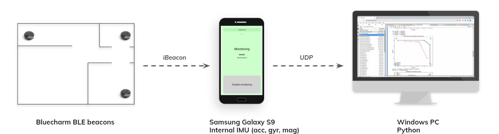
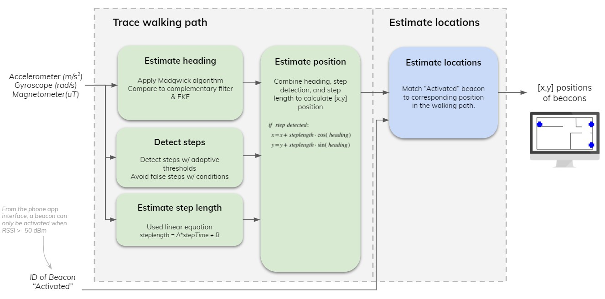
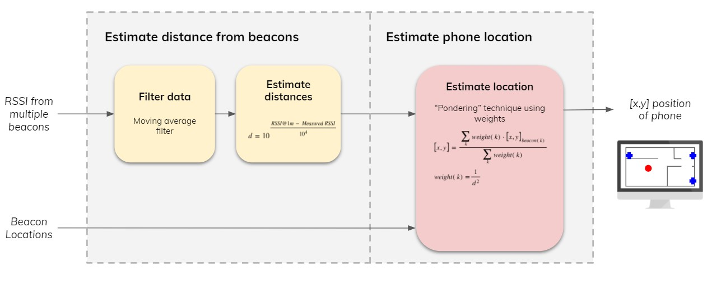
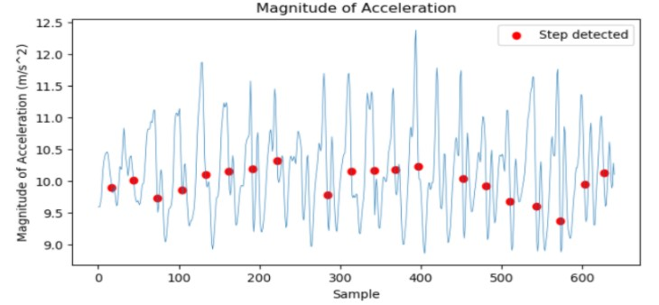
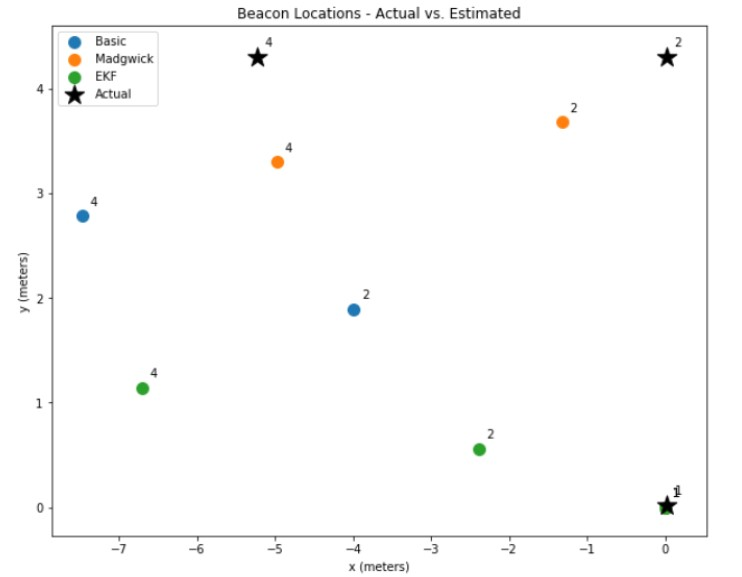
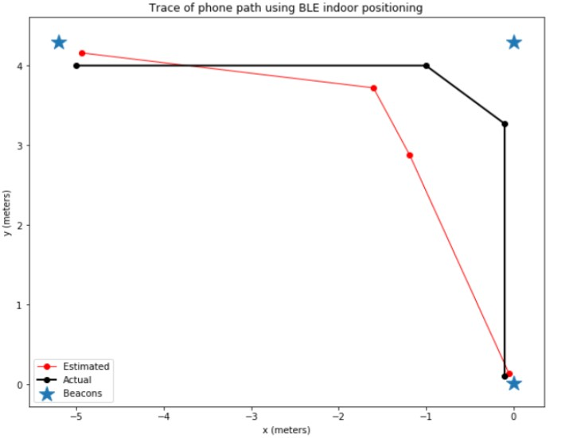
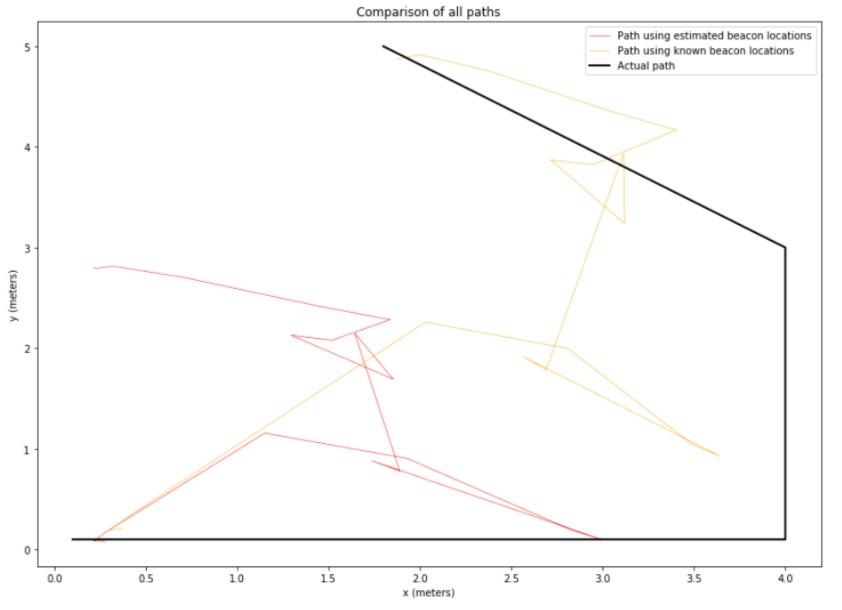

# A practical approach to indoor positioning

UCLA ECE M202A Final Project by Max Gong, Fall 2020

Formerly titled "Auto-Generate Map of BLE Beacons for Indoor positioning Using a Phone's Motion Sensors"

## Abstract

Bluetooth Low Energy (BLE) beacons for indoor positioning have been studied closely in the past decade and have even developed into a marketable technology, as BLE is a cheap indoor positioning solution that is valuable in many industry verticals such as warehousing and construction.

However, there are very few solutions for locating the position of the BLE beacons themselves. Typically, once beacons are placed in their spot, the locations of the beacon have to be manually entered. This presents a major hassle for the user and can result in inaccuracies. 

The ultimate goal of this project is to create a practical approach to indoor positioning. More specifically, there are two deliverables to this project: 1) Mapping: Use a phone’s motion sensors to estimate BLE beacon locations & set up a map of beacons, 2) Indoor Positioning: Use BLE RSSI to locate the position of the phone, based on the map of BLE beacons.

The results showed some promise of accuracy, with an MSE of 0.84m in determining beacon location and MSE of 0.78m in indoor positioning when using known beacon locations. However, with an MSE of 3.48m in indoor positioning when using the estimated beacon locations, there is still much room for improvement. 

## Motivation

Indoor positioning brings a lot of value to many industry verticals. In warehouses, being able to navigate to an item or to a shelf can help save money and time. In construction or mining sites, knowing the location of your personnel can ensure they remain safe and avoid entering dangerous areas.

Bluetooth Low Energy (BLE) beacons have been studied closely in the past decade as an affordable, low-power solution to indoor positioning. They have an accuracy range of about 0.5-2 meters, which is perfect for many office, warehouse, and large building settings.

***However, there are few solutions for locating the beacons.*** Once beacons are placed in their spot, the user will typically have to manually enter in the location of the beacons. This presents a major hassle for the user and can result in inaccuracies. 

***What if there was a way to auto-map beacons once you set them down in their spots? What if all you needed was your phone to locate the beacons?*** 

## Goals & Deliverables

Goal: ***Create a practical approach to indoor positioning.*** 

Deliverables:
1. ***Mapping***: Use a phone’s motion sensors to locate and generate a map of beacons. For instance, a user would walk from beacon to beacon. Once the user has walked to all beacons, the beacons are automatically located & a map of beacons is generated.
2. ***Indoor positioning***: Use BLE RSSI to locate the position of a phone, based on the map of BLE beacons. 

## Prior Works

BLE beacons have gained recent attention because they provide a low-cost indoor positioning solution that can offer an average position estimation error of 0.53 meters [1]. Many prior works focus on improving the accuracy of indoor positioning when using BLE beacons. Paper [1] presents an indoor positioning solution using Apple’s iBeacon protocol and weighted calculations of RSSI readings. Paper [2] presents an improved bluetooth beacon-based indoor positioning method that uses a combination of weighted distance estimations and their novel distance pondering algorithm, instead of the classic triangulation technique. This results in a position estimation error of less than 1.5 meters. Paper [3] is able to achieve a positioning accuracy of 0.2-0.5m using BLE RSSI and Kalman filtering. Position estimation errors of 0.5 to 1.5 meters are accurate enough for indoor positioning in large spaces such as warehouses, given that the position of the beacons are known.

Tracing a person’s walking path using a phone’s IMU has shown to be relatively accurate, and many works have been published on using IMU for path tracing. Paper [4] presents a smartphone-based hand-held indoor positioning system that only uses the phone’s accelerometer and gyroscope. The paper uses ZUPT to for step detection, body geometry to calculate step length, and Kalman filter to estimate attitude. The paper was able to generate a 3D map of the person’s walking trail, with an estimation error of 1m out of 65.3m walked. Paper [5] also uses very similar techniques as paper [4], with a Kalman filter to estimate heading and a pitch-based algorithm to estimate stride length. This paper was able to generate a 2D map of the person’s walking trail, with a displacement error of about 1.2m out of 150m walked.

I have only found two works that use IMU to locate the position of beacons. Paper [6] uses on-line calibration on a set of beacons and a fusion of BLE RSSI and a phone’s motion sensors to locate the position of BLE beacons. They were able to achieve a location error of 1.2 to 1.8 meters. The limitation with this work is that it requires the user to make an L-shaped pattern. Paper [7] uses graph-based SLAM techniques to process IMU and BLE RSSI readings to determine the position of beacons. The paper also uses the estimated beacon positions to perform BLE RSSI based indoor positioning to locate phone position. This paper was able to achieve a beacon position estimation error of 1.27 - 2.26 meters and a phone position estimation 3.25 - 4.69 meters. These papers are most relevant to my first deliverable of using IMU to locate the beacons. 

## Materials and Methods

#### These are the hardware and software I used: 

- BlueCharm BLE beacons
  - Used iBeacon protocol
  - Specs: -59dBm @1m 
- Samsung Galaxy S9 Android phone
  - Coded in Android Java
  - Used Altbeacon library for processing BLE RSSI data
  - Used DataSocket library for sending data through UDP
  - Used phone’s internal IMU sensor - accelerometer, gyroscope, magnetometer
- PC
  - Coded in Python
  - Used AHRS & scikit-kinematics libraries to calculate heading
  - Used & modified Takaklas’ Github algorithm to detect steps & estimate stride length
  - Used socket library for receiving data through UDP

#### Here is the technical approach to Mapping:  

Mapping can be split into two parts: 1. Tracing the walking path from IMU data, and 2. Estimating beacon location based on the estimated walking path and beacon ID. 

Tracing the walking path is split into four components: 1. heading estimation, 2. step detection, 3. step length estimation, 4. combining all components to estimate position. In heading estimation, I used and compared three different methods. In the first method, I used classic techniques. I applied a complementary filter on accelerometer and gyroscope readings to estimate roll and pitch, and I used roll, pitch, and magnetometer readings to estimate heading. In the second method, I used the Madgwick algorithm provided by the Python AHRS library to estimate phone attitude [8]. The Madgwick algorithm essentially takes in accelerometer and gyroscope readings to provide initial estimates of attitude and magnetometer to correct the attitude estimation. In the third method, I used the motion-based EKF algorithm provided by the Python scikit-kinematics library to estimate phone attitude [9]. This EKF algorithm essentially uses accelerometer and magnetometer readings to correct the attitude estimated using the gyroscope’s angular velocities. 

In step detection, I used a series of adaptive thresholds and conditions. I adapted & modified the algorithms from Takakla’s PDR library [10] and paper [11] on step detection. To briefly describe the algorithm, the magnitude of accelerometer readings on all x, y, and z axis was compared to an adaptive threshold to identify the start and end of a step. To ensure it’s an actual step, conditions were applied to ensure the step lasts greater than 0.1 seconds and the amplitude of the step is sufficiently large. The threshold adapts by taking the average of the min and max magnitude values every 0.5-1 second. 

In step length estimation, I used a simple linear equation that relates step time to step length. I verified this linear equation using paper [12] on step length estimation. 
In the last step of tracing the walking path, I combined all heading, step detection, and step length estimation to determine (x,y) position. To briefly describe, every time a step is detected, the new position is calculated from the previous position using basic trigonometry on step length and heading. 

The final part of Mapping is to map the beacon locations to the position. This is done by simply matching the timestamp of the beacon ID to the corresponding timestamp of the position estimated. The timestamp of the beacon ID is recorded when the user hits an “Activate” button on the Android app. Note that, to ensure the user is actually near a beacon when this button is pressed, the button only becomes visible when the user is less than -50 dBm to a beacon. 

#### Here is the technical approach to Indoor Positioning: 

Indoor positioning can be split into two parts: 1. Estimate distance from each beacon, 2. Estimate phone locations. 

There are two parts to get an accurate distance estimate from BLE RSSI. First, I used a moving average filter to reduce noise & spikes in RSSI data. Then, I provide a distance estimate using a classic exponential formula, with an environmental factor of 4 due to the many signal interferences in the environment I tested my project in. From these, I was able to get a distance estimate from each beacon. 

To estimate phone location, I used the “pondering” technique mentioned in [2]. This pondering technique considers that a near distance beacon has more influence on the location of a phone versus a further distance beacon. Thus, the pondering technique takes advantage of weights & summation of beacon locations to estimate phone location. In my tests, pondering produced much more sensible results than classic triangulation techniques. 

## Project Setup

#### Here is the flow for Mapping: 

1. I set up 3-4 beacons around my apartment.
2. I walk from beacon to beacon to begin mapping.
3. While mapping, I click the “Activate” button whenever I’m close to a beacon. In the background, this sends the corresponding beacon ID to the PC through UDP.  
4. In the background, the Android phone app sends IMU data & beacon IDs at 50Hz to PC, using UDP.
5. The Python program on the PC processes IMU data & beacon ID to locate beacons.
6. The Python program generates a map of beacons, which is ready to use for indoor positioning.

#### Here is the flow for Indoor Positioning: 

1. I turn on BLE monitoring on the Android phone app.
2. In the background, the Android phone app sends BLE RSSI data to the PC through UDP.
3. The Python program on the PC uses BLE RSSI data to locate the position of the phone.
4. The Python program generates a real-time map that displays the position of the phone in relation to beacon positions.

## Results

#### Mapping
The results for mapping show promise, but can use improvement. Here, I looked at two metrics. The first metric is step detection accuracy. Five paths were recorded. From these paths, the system was able to detect 94.3% of steps, and only falsely identified 1 in every 20 steps on average. One thing I noticed is that these false steps occur when I pick up the phone and place the phone down. The second metric is beacon location accuracy, which encapsulates the cumulative accuracy of heading, step length estimation, and position estimation. Here, I compared the MSE of the beacon locations estimated using the different attitude & heading estimation methods. Eight runs were recorded. From these runs, the average MSE of the estimated location is as follows: complementary/basic method 2.47m, Madgwick 0.84m, and EKF 2.65m. It seems EKF and complementary/basic methods were not able to adapt to the sharp changes in heading, while Madgwick showed the best results in estimating beacon locations.  

#### Indoor Positioning
The results for indoor positioning with known beacon locations is relatively accurate and falls within expected results. Five runs were recorded. From these runs, the MSE of the estimated phone locations vs. my actual phone locations was 0.78m on average. This falls within the expected range of 0.5-2m in BLE indoor positioning accuracy. 

#### Mapping + Indoor Positioning
The results for indoor positioning with estimated beacon locations shows questionable accuracy. The MSE of the estimated phone locations using estimated beacon locations vs. my actual phone locations was 3.48m. Although this falls within the expected range of 3.25 - 4.69m in paper [7], it may not be suitable for applications where typical BLE accuracy of 0.5-2m is needed. 

## Strengths
I’ve identified 3 main strengths of this project. 
1. This project presented a user-friendly, practical approach to indoor positioning, by providing a beacon-locating & mapping solution combined with an indoor positioning solution, all from just a phone, BLE beacons, and a PC. The project provided expected accuracy for mapping and indoor positioning, which validates this approach to indoor positioning. 
2. It’s a power-friendly solution. It only uses up most of the power during mapping, when collecting IMU readings at 50Hz, but it uses low-power BLE during indoor positioning, which would be the most used application in a real world scenario. 
3. Though relatively inaccurate, this project showed that it is possible to use a phone to trace walking paths without the use of GPS, which is typically not accurate in indoor settings. 

## Weaknesses
I’ve identified 3 core weaknesses of this project. 
1. The algorithm used to trace walking paths may not be robust. Because only IMU data is used, there’s no measure of reference to correct the estimated walking path. This may mean error may accumulate over a longer walking path. In this project, I was unable to test longer walking paths due to COVID restrictions. The use of only IMU and lack of reference position is also a core reason for the 3.48m MSE when estimating phone location using the estimated beacon locations. 
2. The algorithm used to trace walking paths is limited to walking, as it uses step detection and stride length estimation to estimate the walking path. 
3. Due to COVID, I tested this project only on myself, with my own walking data. So the path tracing algorithm may not work for other people, as stride length and step detection may be different for different people. 

## Future Improvements
I’ve identified 3 core future tasks that would make this project much more robust and practical. 
1. Path tracing could be improved by fusing IMU with the phone camera using SLAM techniques. Using SLAM also removes the limitation of walking, step detection, and stride length estimation. 
2. Path tracing can also be more robust by testing for longer paths and testing with more people, not just myself. 
3. Indoor positioning could be made more robust by testing in environments with different levels of electrical interference, as these can affect RSSI readings and therefore affect the accuracy of locating a phone. 

## Conclusion
This project succeeded in providing a practical approach to indoor positioning. The accuracy of mapping, the accuracy of indoor positioning with known beacon locations, and the accuracy of indoor positioning with estimated beacon locations all fall within the expected range of results in literature. Yet despite falling within expectations, I believe this level of accuracy is not yet applicable towards a real-world environment. For next steps, I believe that using the phone’s camera and SLAM techniques will provide a huge improvement in accuracy, and this project provides a great starting point for that. 

## References

[1] [An iBeacon Primer for Indoor Localization](https://dl.acm.org/doi/10.1145/2674061.2675028) 

[2] [Improved bluetooth beacon-based indoor location and fingerprinting](https://doi.org/10.1007/s12652-019-01626-2) 

[3] [An Indoor Positioning Algorithm Using Bluetooth Low Energy RSSI](https://www.researchgate.net/publication/306325749_An_Indoor_Positioning_Algorithm_using_Bluetooth_Low_Energy_RSSI)

[4] [A Smartphone Based Hand-Held Indoor Positioning System](https://www.researchgate.net/publication/301529181_A_Smartphone_Based_Hand-Held_Indoor_Positioning_System) 

[5] [An Indoor Position-Estimation Algorithm Using Smartphone IMU Sensor Data](https://ieeexplore.ieee.org/stamp/stamp.jsp?tp=&arnumber=8606925)

[6] [Locating and Tracking BLE Beacons with Smartphones](https://dl.acm.org/doi/10.1145/3143361.3143385)

[7] [Indoor Positioning Based on Bluetooth Low Energy Beacons Adopting Graph Optimization](https://www.ncbi.nlm.nih.gov/pmc/articles/PMC6264008/)

[8] [Python AHRS library](https://ahrs.readthedocs.io/en/latest/filters/madgwick.html)

[9] [Python Scikit-kinematics library](http://work.thaslwanter.at/skinematics/html/imus.html?highlight=kalman#imus.kalman)

[10] [Takaklas' Github algorithm for PDR indoor positioning](https://github.com/Takaklas/Indoor-Localization-WIth-IMU/blob/master/position_PDR.py)

[11] [Step Detection Algorithm for Accurate Distance Estimation Using Dynamic Step Length](https://ieeexplore.ieee.org/document/7962470)

[12] [AutoGait: A Mobile Platform that Accurately Estimates the Distance Walked](http://netlab.cs.ucla.edu/wiki/files/autogait.pdf)

